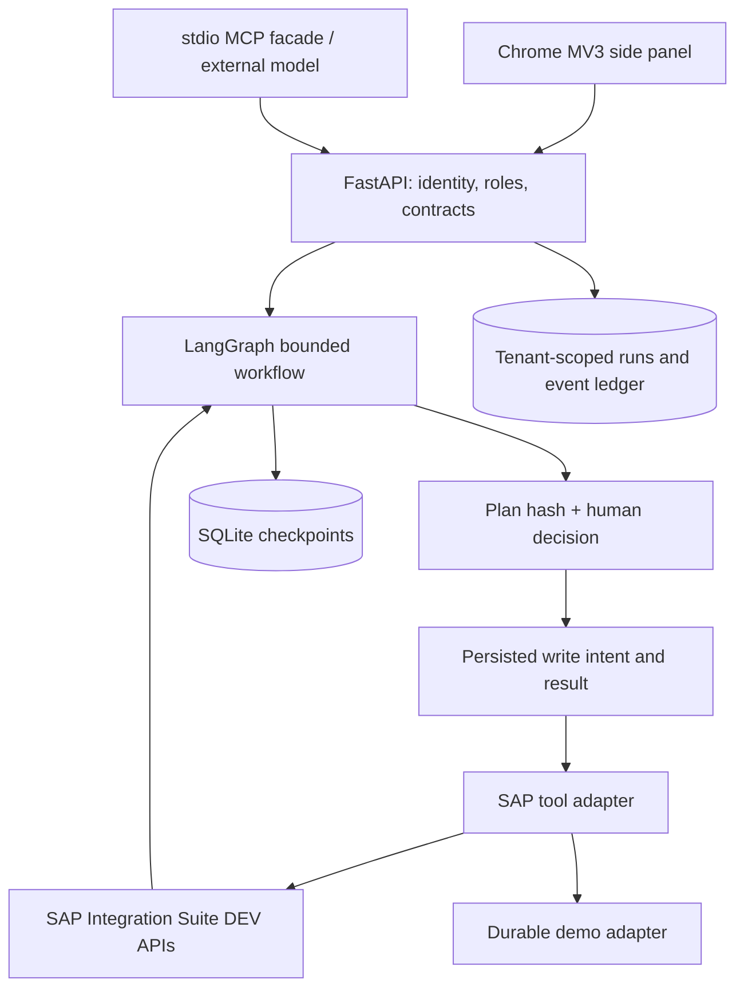

# Relay — SAP Integration Agent MVP

A Chrome side-panel developer workspace for approval-gated SAP Integration Suite **DEV** operations. FastAPI owns authentication and tools; LangGraph checkpoints the workflow in SQLite. Demo mode runs locally without SAP credentials. Live mode uses SAP OAuth client credentials and Cloud Integration OData APIs.

**Scope:** a constrained workflow agent, with deterministic execution plans from typed actions. Optional free-only OpenRouter planning translates a description into a validated intermediate flow specification; it cannot execute or approve it. The general HTTPS JSON compiler composes validation, nested mapping, type conversion, arithmetic, filtering, deduplication, sorting, routing, collection processing and response shaping. Requests needing external adapters return configuration questions instead of a false success. See [the designer guide](docs/IFLOW-DESIGNER.md). The MCP facade lets an external model discover content and propose a supported run. Humans approve in the side panel. This is a runnable development MVP, not a production-ready SaaS deployment.

## Start locally

### Studio update — September 25, 2026

The description workflow now composes native SAP BPMN topology: collection inputs use General Splitter, a local record process and Gather; conditional routes use visible Router branches; mapping, calculations and response shaping have separate tasks. The bundled bpmn-js viewer renders the exact XML contained in the proposed ZIP before approval. This is a viewer, not a second runtime: SAP executes the iFlow and LangGraph orchestrates the approved deployment.

The refreshed dark studio uses four explicit steps: **Describe → Plan → Diagram → Deploy**. Describe captures the destination package, scenario, refinements and optional acceptance JSON. Plan shows requirement-by-requirement evidence, proposed flows, assumptions, blockers, clarification questions and source provenance. Diagram renders the exact BPMN XML in the proposed ZIP. Deploy shows the immutable change plan and requires a separate human approval before SAP is changed.

`POST /v1/solutions/analyze` creates a tenant-scoped, persisted solution plan without writing to SAP. `POST /v1/solutions/{plan_id}/build` compiles that frozen plan once and creates an awaiting-approval run; repeats return the same run. The build gate permits one supported HTTPS JSON request-response flow only when every requirement has compiler evidence and any supplied acceptance sample matches. Multi-flow designs and external adapters remain visible as architecture proposals with explicit questions and blockers.

Live tests passed for five distinct designs in `RelayTest`, plus ten malformed-input, missing-field, empty-batch and record-limit checks. The ticket-routing case was generated, reviewed and deployed through the refactored UI. The workspace uses a description panel, central canvas and deployment review; narrow Chrome panels show these as three steps. See [native BPMN results](docs/NATIVE-BPMN-STUDIO.md). External receiver adapters and unrestricted arbitrary process graphs remain outside this compiler's supported scope.

Requires Python 3.12+ and [uv](https://docs.astral.sh/uv/). From this repository:

```sh
uv sync --frozen
uv run python scripts/init_demo.py
uv run uvicorn app.main:create_app --factory --app-dir backend --host 127.0.0.1 --port 8000
```

Open [the local workspace](http://127.0.0.1:8000) for a browser preview of the same UI. Copy the random key from `API_KEYS_JSON` in `.env` into the connection form; the key is the property name, not the whole JSON object. No default password is built into the app. `.env` is generated with owner-only permissions and is ignored by Git.

### Load the Chrome side panel

1. Open `chrome://extensions`, enable Developer mode, and choose **Load unpacked**.
2. Select this repository's `extension` directory. Pin Relay and click its toolbar icon.
3. Connect to `http://127.0.0.1:8000` using the local token. If your Chrome configuration requires CORS, set `EXTENSION_ORIGIN=chrome-extension://<actual-extension-id>` in `.env` and restart the backend.
4. Keep the default `AgentSandbox` / `HelloWorld`, create a plan, inspect the diff, then approve.
5. See the timeline, read-only test result, and audit evidence. Download the generated Python smoke test.

The extension is Manifest V3, requires Chrome 116+, uses `sidePanel` and `storage`, and has only localhost backend host permissions. It does not scrape SAP pages, inject content scripts, or collect browser cookies. For a remote backend, add only its specific HTTPS origin to `host_permissions`, set the exact extension CORS origin server-side, and reload the extension. A browser-hosted preview is included for development, not as an authentication substitute.

## Messaging patterns

Separate JMS retry and Solace layered-event designs are now available. Solace supports approval-gated **upload without deployment** until broker configuration is ready. See [messaging contracts and voice roadmap](docs/MESSAGING-AND-VOICE.md). Voice input, description-first order design and background approvals are implemented. WhatsApp is implemented for local testing and remains disconnected. See [voice and WhatsApp setup](docs/VOICE-WHATSAPP.md).

## What works

- Server-owned tenant identity and viewer/operator/approver roles, derived from opaque bearer keys.
- Generate and inspect a description-driven HTTPS JSON pipeline; review the typed design, scripts and ZIP before approval.
- List/read packages, list/read design-time iFlow metadata, create a package.
- Validate an exported iFlow ZIP, show SHA-256 and file inventory, create a **new** artifact where enabled, then deploy its active version.
- Deploy an existing version, capture SAP build task ID, bounded status polling, runtime read-back, and recent MPL summaries.
- Persistent plan review, approve/reject, execution evidence, history, and recovery after process restart.
- A generated Python smoke test and an equivalent executed read-only assertion. No business payload is sent.
- One newly approved redeploy of an unchanged existing iFlow after a conclusive build failure. Unknown/in-progress deployments stop for inspection instead of being duplicated.
- stdio MCP tools that share the HTTP backend's tenant and approval boundaries.

**Boundaries:** no update/overwrite/delete/undeploy, arbitrary code execution, model-generated bundle, automatic semantic code repair, unrestricted business transaction testing, production tenant, self-service onboarding, SSO or billing. The WhatsApp channel is implemented for signed local webhook testing but is not connected to a Meta business number. APIM and Advanced Event Mesh have read-only inventory adapters; full TPM/agreements are not implemented. ZIP validation checks structure and parses model XML; it does not certify SAP deployability or inspect all executable scripts. The UI diff is a metadata before/after plan with a ZIP fingerprint, not an XML/Groovy source diff. Live management access and generated iFlow deployments are verified against the configured SAP Trial DEV tenant; see [the solution-workspace evidence](docs/solution-workspace-acceptance.json).

## Architecture



The graph follows discover → plan → approve → execute → observe → validate → test → verify → audit. Failed validation routes to fix; a conclusive failed build on an existing artifact can interrupt for one retry approval, then redeploy → observe → validate. All other failures require attention. Rejection goes directly to audit. Expected tool errors are recorded and surfaced with a recovery control.

Approval binds an immutable server-side plan digest, including tenant, target IDs/version, observed metadata, operation list and bundle hash. Before the first write, discovery metadata is checked again. Completed operations return stored results when replayed. A persisted `started` operation without a result is **ambiguous** and blocks replay. SAP does not participate in the local SQLite transaction: this is fail-closed recovery, not exactly-once distributed execution. Metadata preflight is best-effort optimistic checking, not a remote lock or full content hash.

SQLite and an in-process mutation lock deliberately limit this release to **one process / one worker**. Each run is owned by a server-derived tenant; clients cannot override that owner. See [security notes](docs/SECURITY.md) before exposing the service to a network.

## Connect a real DEV tenant

1. Copy `tenants.example.json` to `.tenants.json`; enter the actual Cloud Integration management API URL ending in `/api/v1` and OAuth token URL from the appropriate service key. Do not use the Integration Suite launchpad URL as the API URL.
2. Create an SAP service instance/key with client-credentials access and the necessary design-time, deployment and monitoring permissions for your tenant. Confirm available API operations and roles against your tenant's SAP documentation; permissions vary by provisioning. Keep production credentials out of this MVP.
3. Set `SAP_DEV_CLIENT_ID` and `SAP_DEV_CLIENT_SECRET` in `.env` (or injected environment secrets). Environment values take precedence. Credentials are only read by the backend.
4. Add a random API key mapping to `tenant_id: "sap-dev"` in `API_KEYS_JSON`. Give read-only users `viewer`; use `operator` for MCP proposal clients; reserve `approver` for trusted people. Restart the backend after configuration changes.
5. Connect the side panel with that tenant's key. Confirm **SAP · DEV**, list packages, and read an existing iFlow before attempting a write.
6. Create a disposable package through a reviewed plan. Enable `allow_upload: true` only after confirming tenant API support. Upload an exported, known-good ZIP using a new globally unique artifact ID. Bindings, destinations, security material and externalized configuration may still require manual SAP setup.
7. Deploy and inspect the build task and runtime evidence. If polling expires, inspect `/v1/deployments/{task_id}` and SAP monitoring before planning any redeployment.

Deploying a DEV iFlow can still contact external systems or activate timers. Approvals display that risk. Labeling a connection `DEV` cannot independently prove the remote tenant is a DEV system; the administrator must enforce that boundary.

## Tests and contracts

```sh
uv run pytest
uv run ruff check backend
node --check extension/panel.js
```

[API/tool contracts](docs/CONTRACTS.md) describe request shapes and recovery semantics. Live OpenAPI is at `/openapi.json`; interactive API docs are at `/docs` (authorize with your token). The generated smoke test uses `AGENT_URL` and `AGENT_TOKEN` environment variables and runs with `pytest test_dev_smoke.py`.

For MCP, start the backend first and inject an **operator** token into the MCP process:

```sh
PYTHONPATH=backend AGENT_URL=http://127.0.0.1:8000 uv run python -m app.mcp_server
```

Set `AGENT_TOKEN` securely in the process environment. MCP exposes no approval or unrestricted write endpoint. An external agent can call `propose_run`; a person reviews the resulting run in History. The graph calls the same internal adapter directly, avoiding unnecessary MCP loopback for execution. The SDK is intentionally pinned to the tested v1 API (`mcp<2`).

## Repository map

- `extension/`: installable MV3 side panel, service worker, browser preview.
- `backend/app/agent.py`: graph, approval checkpoints, bounded remediation and recovery.
- `backend/app/sap.py`: live and persistent demo adapters.
- `backend/app/store.py`: run ownership, evidence, side-effect journal and demo state.
- `backend/app/main.py`: authenticated REST interface and preview hosting.
- `backend/app/mcp_server.py`: MCP facade.
- `backend/tests/`: lifecycle, restart, isolation, policy and mocked SAP contracts.
- `modules/`: capability contract for later APIM, B2B/TPM, Event Mesh and migration.
- `docs/`: API contracts, security, references, phased roadmap and verification.

## References and next phases

The implementation uses the official [AI-enabled Integrations CodeJam](https://github.com/SAP-samples/ai-enabled-integrations-codejam) as a reference for Integration Suite and MCP concepts, and [Code-Based Agents CodeJam](https://github.com/SAP-samples/codejam-code-based-agents) for SAP agent development/deployment context. No sample source or iFlow bundle was copied into this repository. Endpoint behavior is based on SAP documentation and remains subject to real-tenant acceptance testing.

See [annotated resources](docs/RESOURCES.md), [phased roadmap](docs/ROADMAP.md), and [verification record](docs/VERIFICATION.md).

### Optional container packaging

`docker compose up --build` starts the same single-worker demo backend on loopback and persists SQLite in a named volume. Run the bootstrap script first to create `.env`. Docker packaging is provided but was not built in this session. To use live tenants in a container, explicitly bind-mount `.tenants.json` read-only at `/app/.tenants.json` and inject the SAP credential environment variables; the sample Compose setup does not mount tenant secrets automatically.


## Free-only planning and service expansion

Set `LLM_ENABLED=true`, plus server-only `OPENROUTER_API_KEY_1` and optionally `OPENROUTER_API_KEY_2`. The side panel's **Draft with free AI** button submits only the typed goal; it fills the workflow form for review. It does not start a run. Use explicit `package_id` and `artifact_id` in goals for reliable targeting. The normal **Create a plan** → approval sequence remains mandatory.

The default candidate order is `nvidia/nemotron-3-super-120b-a12b:free` then `nex-agi/nex-n2.5-pro:free`. Both passed the three-case strict planning smoke test; Nemotron had lower latency in this small sample, not a general quality ranking. Availability is rechecked against OpenRouter's model catalog. Every request enforces zero prompt/completion price; there is no paid fallback. Calls rotate between configured key slots. Rate limiting pauses both slots rather than rotating to bypass quota.

**Services** checks Cloud Integration and B2B Partner Directory access, and reports APIM/AEM as not configured until separate connections exist. **Create B2B partner parameter** adds a new string parameter through the same approval and read-back workflow. It does not implement TPM agreements, AS2, certificates or business-message testing.

APIM and AEM expose the first inventory page only (up to 50 requested entries); this is not a complete discovery inventory. Configure their service objects using the example in docs/SERVICE-SETUP.md. Their read contracts are tested with mocks; live credentials have not been supplied. The stopped unrelated application in the screenshot was not changed.

[Live test results and remaining requirements](docs/LIVE-TEST-RESULTS.md)

## Chrome extension UI — 0.3

The extension now uses an original dark charcoal and navy interface with a pale lime accent and bundled Manrope typography. It keeps Relay branding and the existing backend workflows. The full-height side panel has fixed navigation and focused Describe, Plan, Diagram and Deploy workspaces, plus Packages, Activity and Connections.

Use `relay-chrome-extension.zip` from the deliverables for the extension-only package. Extract it, then load the extracted `extension` folder through `chrome://extensions` → Developer mode → Load unpacked. Click the pinned Relay icon, or use Command+Shift+Y on Mac / Ctrl+Shift+Y on other platforms. Chrome's extension Options action opens the setup guide. Reload an existing unpacked installation to receive the changes.

The shortcut can be reassigned at `chrome://extensions/shortcuts`. The extension still requires the local backend; this package is not a Chrome Web Store release. A hosted backend and store review remain necessary for public SaaS distribution. New task resets the local form without cancelling existing backend runs. Session tokens remain in Chrome session storage, and no SAP page access was added.

### API research and preflight

See [API research and implementation decisions](docs/API-RESEARCH.md) for SAP operation contracts and the reviewed open-source projects. Connections → **Diagnose SAP APIs** now probes five management collections independently and reports upstream failures without exposing response bodies. The same check is available through `GET /v1/diagnostics`, MCP `diagnose_sap_apis`, and `scripts/check_connections.py`. Read access does not prove write permissions.

Live JMS retry results and Solace upload status: [Messaging acceptance](docs/MESSAGING-ACCEPTANCE-20260916.md).

## Description-first workflow

Type or record a scenario, choose its destination package and press **Analyze solution**. Relay first creates a read-only architecture and coverage review. A buildable single-flow plan can then be compiled into an exact BPMN diagram and immutable deployment plan. The iFlow is written only after **Create iFlow & deploy**. Requests with missing business rules, multiple flows or unimplemented external adapters remain blocked with concrete questions instead of being reduced to a generic design. [Setup and tested scope](docs/VOICE-WHATSAPP.md).
